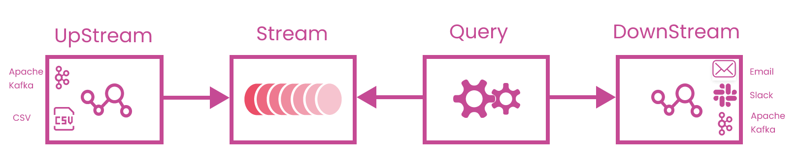

# gluon

Timeplus API SDK

A `gluon` (/ˈɡluːɒn/) is an elementary particle that acts as the exchange particle (or gauge boson) for the strong force between quarks. It is analogous to the exchange of photons in the electromagnetic force between two charged particles.

In Timepluse architecture, `gluon` is the API sdk acting as the connection to Timeplus's ecosystems.

# development

## update api

1. update `spec/swagger.yaml` with the latest neutron api spec
2. `make gen`
3. manually update query: https://github.com/timeplus-io/gluon/blob/fbd30bd1dddfecc5ea10f7fe282f720618cab73e/python/swagger_client/timeplus/queries_v1beta2_api.py#L140 set `_preload_content` to `False`, https://github.com/timeplus-io/gluon/blob/fbd30bd1dddfecc5ea10f7fe282f720618cab73e/python/swagger_client/timeplus/queries_v1beta2_api.py#L114 add `text/event-stream`
4. manully update `swagger_client/rest.py` https://github.com/timeplus-io/gluon/commit/201cf464a7461ff31d34850753922c21f7fbeadb, make sure the string body wont get dumped again
5. go to `python` folder, set env properly and then `make test`
6. `make format` to format the code

## test

Manually try the sample in `examples`
